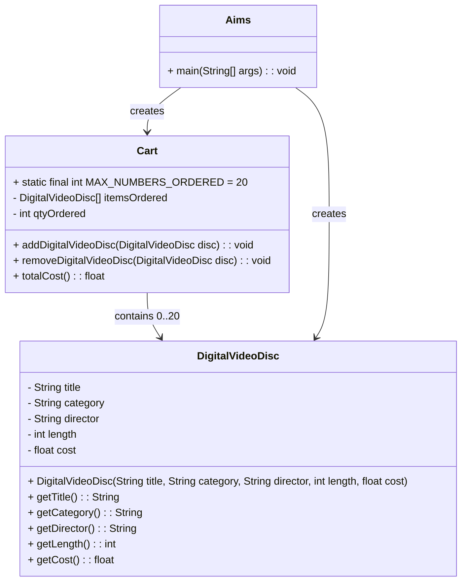

# AimsProject UML Diagrams

## Class Diagram



## Use Case Diagram

```mermaid
usecaseDiagram
    actor User
    User --> (Add DVD to Cart)
    User --> (Remove DVD from Cart)
    User --> (View Total Cost)
    (Add DVD to Cart) .> (View Total Cost) : includes
    (Remove DVD from Cart) .> (View Total Cost) : includes
```

## Summary

- `DigitalVideoDisc.java`: represents a DVD item and exposes getter methods.
- `Cart.java`: stores DVDs, supports adding/removing discs, and calculates total cost.
- `Aims.java`: application entry point that creates DVDs, adds them to the cart, and prints the total.
